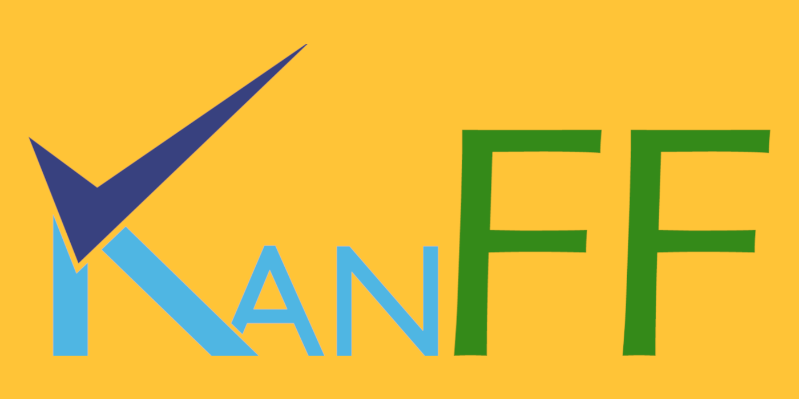
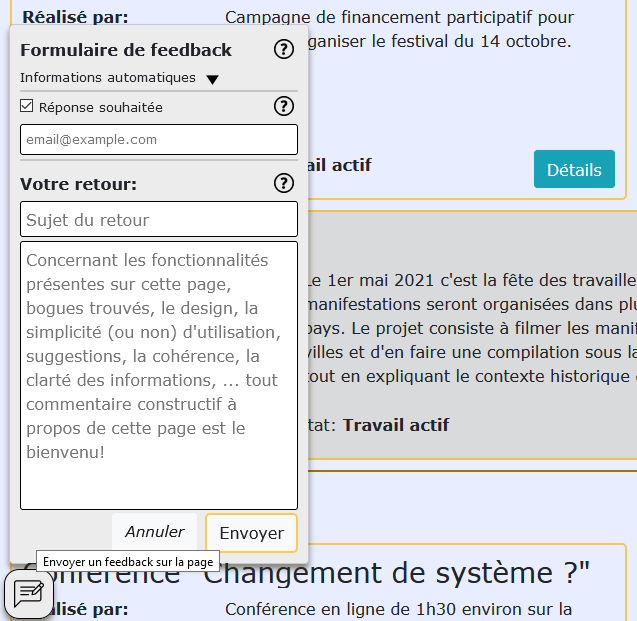
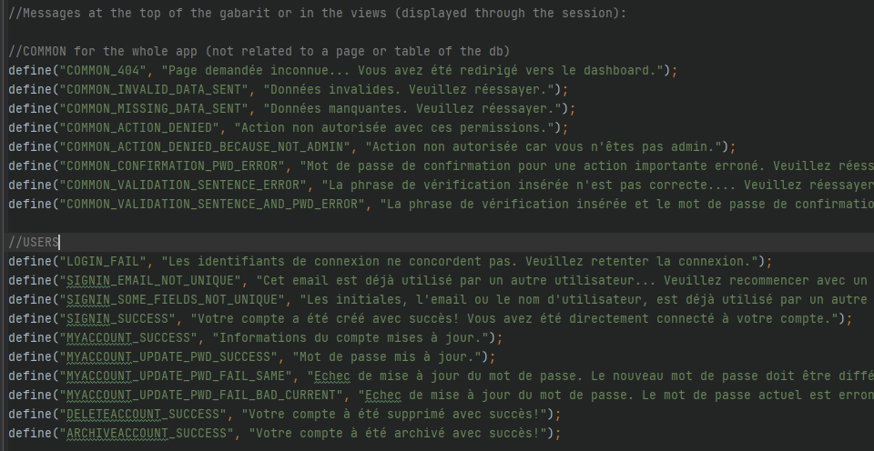
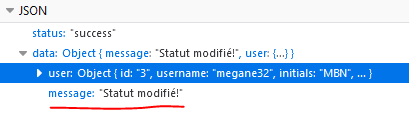
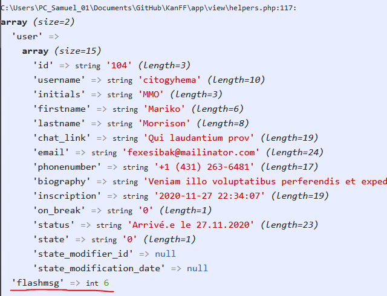
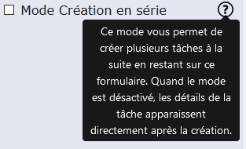
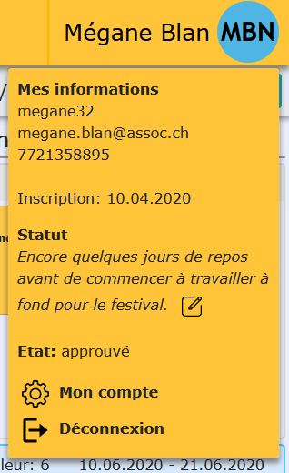
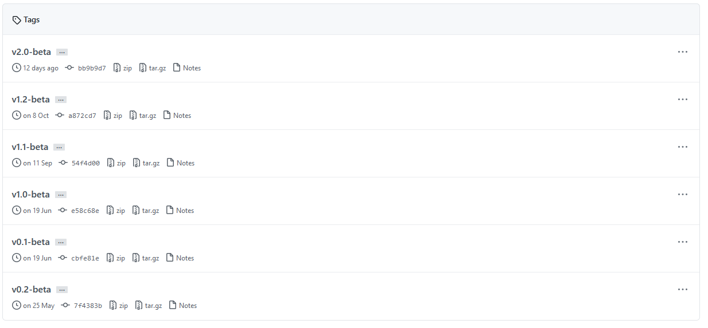
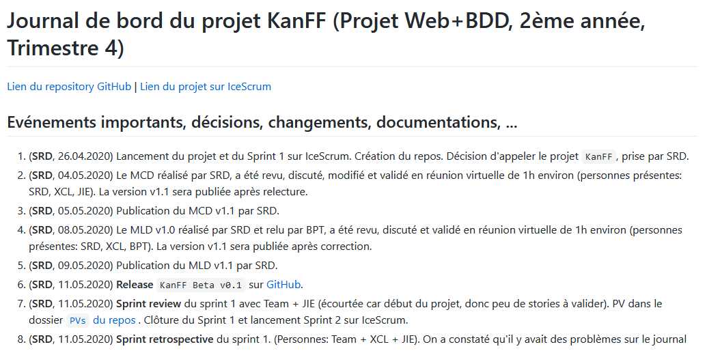

# KanFF - Documentation globale
Ce document globale apporte beaucoup d'informations sur le projet et l'application au niveau technique.   
Rédaction: Samuel, Relecture: Benoît. Version 1.1 du 03.11.2020.  
**Rédaction: Samuel, Relecture: YYYYYY. Version 2.0 du 28.01.2021.**

## Documentations liées spécifiques:
- [Liste des pages](list-pages.md)
- [Liste des fonctions d'aide](helpers-functions.md)
- [Spécifications de la base de données](db-specifications.md)
- [Structure des appels Ajax](structure-ajax-calls.md)

## Table des matières
<!-- MDTOC maxdepth:6 firsth1:1 numbering:0 flatten:0 bullets:1 updateOnSave:1 -->

- [KanFF - Documentation globale](#kanff-documentation-globale)   
   - [Documentations liées spécifiques:](#documentations-liées-spécifiques)   
   - [Table des matières](#table-des-matières)   
   - [Cadre, description et motivation](#cadre-description-et-motivation)   
      - [Objectifs](#objectifs)   
         - [Buts](#buts)   
         - [Ambitions](#ambitions)   
      - [Vision](#vision)   
      - [Identification](#identification)   
      - [Organisation du projet](#organisation-du-projet)   
      - [Découpage](#découpage)   
      - [Comment tester ?](#comment-tester)   
   - [Analyse](#analyse)   
      - [Modèle Conceptuel de Données](#modèle-conceptuel-de-données)   
      - [Modèle Logique de Données](#modèle-logique-de-données)   
   - [Stratégie de tests](#stratégie-de-tests)   
      - [Moyens mis en place:](#moyens-mis-en-place)   
      - [Tests et demandes de feedback extérieurs](#tests-et-demandes-de-feedback-extérieurs)   
   - [Implémentation](#implémentation)   
      - [Vue d’ensemble](#vue-d’ensemble)   
      - [Description technique](#description-technique)   
      - [Conventions](#conventions)   
      - [Points techniques spécifiques](#points-techniques-spécifiques)   
      - [Sécurité](#sécurité)   
      - [Livraisons](#livraisons)   
   - [Conclusion (v2.0-beta)](#conclusion-v20-beta)   
      - [Erreurs restantes](#erreurs-restantes)   
      - [Objectifs atteints](#objectifs-atteints)   
      - [Objectifs non-atteints](#objectifs-non-atteints)   
   - [Conclusion (v2.4-beta)](#conclusion-v24-beta)   
      - [Regard en arrière (par SRD)](#regard-en-arrière-par-srd)   
      - [Erreurs restantes](#erreurs-restantes)   
      - [Objectifs atteints](#objectifs-atteints)   
      - [Objectifs non-atteints](#objectifs-non-atteints)   
   - [Annexes](#annexes)   
      - [Sources – Bibliographie](#sources-–-bibliographie)   
      - [Journal de bord du projet](#journal-de-bord-du-projet)   
      - [Journal de travail du projet](#journal-de-travail-du-projet)   

<!-- /MDTOC -->

## Cadre, description et motivation
**Le projet KanFF consiste à réaliser l'application web KanFF**, afin de permettre de gérer des projets, des tâches et l'organisation du travail en général au sein des collectifs, mouvements, associations ou simples groupes de personnes ayant des projets communs. Ce projet est destiné à une utilisation réelle par un nombre important de personnes.

Le projet part de zéro. Le projet est réalisé durant les périodes prévues à l'école pour tout le monde et à la maison pour les personnes qui le veulent.  
Ce projet prend une autre dimension et utilité que d'autres précédents projets fait durant les cours, puisqu'il est destiné à être utilisé en production et qu'il va continuer après les études et après les modules prévus pour ce projet. L'application est opensource depuis le début (disponible sur GitHub).

### Objectifs
L'application doit pouvoir:
1. **Gérer des projets, des travaux et des tâches** à l'aide de kanbans notamment
1. Répartir le travail et planifier les projets
1. Gérer les **membres** et les **groupes**
1. Planifier **des réunions et des événements**
1. Gérer différents niveaux de visibilité pour les données internes

#### Buts
- **Collaborer efficacement à plusieurs sur des projets**
- Avoir une **vision d'ensemble large** de l'organisation du collectif (de tous les projets, travaux, tâches, événements, groupes et membres du collectif)
- Mieux répartir la charge de travail et inclure de nouvelles personnes et les membres moins engagé·e·s.

Toute la gestion des tâches se fait à l'aide d'un kanban. Chaque projet a son propre kanban qui est découpé horizontalement en travaux et verticalement en 3 colonnes (A faire, En cours, Terminé). Chaque travail contient des tâches qui sont dans une des 3 colonnes.


#### Ambitions
- **Polyvalente**, adaptée à divers types de collectifs, de différentes tailles, structures et objectifs, organisation du travail et réalisant des projets de nature différente, ...
- **Kanban optimisé**. D'autres applications de gestion de projets proposent déjà des kanbans, mais la plupart ne sont pas séparés horizontalement en travaux (ou équivalent). KanFF a une structure de kanban inspirée d'iceScrum avec les tâches séparées dans les travaux (parties de projets).
- **Simple d'utilisation**, fluide et rapide à apprendre.
- **Intuitif et compréhensible** en majorité sans le mode d'emploi, pour un maximum de générations.
- **Niveaux de visibilités** pour permettre de protéger les informations sensibles et permettre aux groupes sensibles d'utiliser l'applicaiton sans changer son utilisation.
<!--
WIP. A réfléchir et travailler! Version non-finale.
- **Code ouvert, neutralité et transparence**: tout le code doit être ouvert, les algorithmes doivent afficher le même résultat pour les personnes du collectif (à l'exception des éléments masqués par leur niveau de visibilité), toutes les données stockées dans la base de données ainsi que les algorithmes particuliers (notamment de tri) doivent être documentés et compréhensibles par le grand public.
- **Aucune surveillance**: pas de télémétrie, aucun traçage (données stockées sont celles créée/générés consciemment par les membres, donc pas de données d'utilisation).
- **Amélioration et évolution par les retours/feedbacks**: les feedbacks doivent être simples à envoyer et doivent être pris en compte pour que l'application soit vraiment conçue pour les collectifs, et évoluer dans le temps selon les besoins (sans réinventer des fonctionnalités qui existent déjà dans l'opensource).
- **Un pouvoir partagé**: il n'y a pas 1 admin qui gère tout, mais plusieurs admins et plusieurs types (admins du collectif, admins par groupe, membres nommés responsables, ...). Cela permet d'avoir une structure horizontale tout en ayant des admins.
- **Design propre et coloré**: design propre et a minima utilisable sur ordinateur.
-->

### Vision
Les collectifs sont confrontés à de nombreux problèmes dans la gestion des projets, car ne bénéficiant pas d'outil adapté et étant soumis à des contraintes d'investissements et de compétences de leurs membres, contrairement au monde professionnel. Leur structure horizontale et/ou moins hiérarchique complique l'organisation.

### Identification
**Nom**:
Pourquoi **KanFF** ?? **Kan** vient de **"Kanban"** car c'est l'élément principal de l'application et **FF** est l'acronyme de **"For Future"**, inspiré du mouvement international **Fridays For Future** et à tous les noms dérivés "Strike For Future", "Teachers For Future", "Parents For Future", ... De plus, le logo inclut un "vu" bleu foncé dans la lettre **K** car **le vu est le symbole de la tâche terminée**.

**Logo sur fond jaune**:


### Organisation du projet
Ce projet est réalisé dans le cadre du cours **Projet Web+BDD** au CPNV en informatique en fin de 2ème et début de 3ème année. Après le cours **Projet à choix en binôme**, il n'y aura plus de périodes de travail durant le temps scolaire, cependant le projet ne va pas s'arrêter! C'est un projet assez long en comparaison des autres projets fait au CPNV (22 semaines de cours a minima).
L'équipe travaille sous les principes de **la méthode Agile Scrum**. Ainsi chaque personne a un rôle (les membres changent selon les trimestres):

**Team Trimestre 8 (Projet Web BDD, 7 * 45min par semaine):**
- Samuel: Product Owner et développeur
- Simon: développeur et Scrum Master remplaçant
- Luis: développeur
- Benoît: développeur
- Miguel: développeur
- Kevin: développeur
- M. Ithurbide: Scrum Master + aide technique et conseils
- M. Carrel: Aide technique et conseils

**Team Trimestre 9 (Projet Web BDD, 5 * 45min par semaine):**
- Samuel: Product Owner et développeur
- Luis: développeur
- Benoît: développeur
- Miguel: développeur
- M. Ithurbide: Scrum Master + aide technique et conseils
- M. Carrel: Aide technique et conseils

**Team Trimestre 10 (Projet à choix en binôme, 9 * 45min par semaine):**
- Samuel: Product Owner et développeur
- Benoît: développeur
- M. Carrel: Aide technique et conseils
- M. Hurni: Aide technique et conseils

### Découpage
Le projet étant relativement long, il est découpé en 3 parties. L'unité de temps est le sprint (selon la méthode Scrum) qui correspond à un cycle de 2-3 semaines pour nous, étant une petite équipe.

   1. **Trimestre 8: 6 semaines** (3 sprints) de travail à 6 personnes pour le cours "Projet Web+BDD" entre le 27.04.2020 et le 05.06.2020 pour une release significative "**Beta 1.0**".
   1. **Trimestre 9: 8 semaines** (3 sprints) de travail à 4 personnes pour le cours "Projet Web+BDD" entre le 22.06.2020 et le 13.11.2020 pour une release significative "**Beta 2.0**".
   1. **Trimestre 10: 8 semaines** (4 sprints) de travail à 2 personnes pour le cours "Projet à choix en binôme" entre le 16.11.2020 et 28.01.2021 pour une release significative "**1.0**" qui sera une version de production donc utilisable.
Ces parties correspondent au temps de cours. Durant les vacances et à d'autres moments, du travail est également fourni par une partie des participants.

### Comment tester ?
Vous voulez voir à quoi cela ressemble ? Pas besoin d'installer un serveur en local pour commencer, l'instance de test est à disposition: [try.kanff.org](https://try.kanff.org).

**Identifiants** (structure initiales - email - mot de passe - état):
- Josette Richard (`JRD` - `josette.richard@assoc.ch` - `Josette` - admin)
- Vincent Rigot (`VRT` - `vincent.rigot@assoc.ch` - `Vincent` - banni)
- Mégane Blan (`MBN` - `megane.blan@assoc.ch` - `Mégane` - approuvé)
- Michel Charrière (`MCE` - `michel.charriere@assoc.ch` - `Michel` - approuvé)
- Cassandra De Castro Del Amino (`CDO` - aucun - `Cassandra` - non approuvé)

Vous pouvez aussi créer un compte (avec des données fictives! tout est public sur cette instance de test, et pas sécurisé surtout) et aller vous auto-approuver avec le compte admin de JRD. Ne changez pas le mot de passe des comptes préexistants (vous pouvez changer celui de votre compte si vous voulez tester).

**Pour commencer**:
1. Se connecter avec des identifiants donnés (au-dessus) ou se créer un compte fictif.
1. Lire la page A propos, pour mieux connaitre le collectif l'instance et comprendre dans les grandes lignes la structure de KanFF.
1. Découvrir les pages Projets, Groupes et Membres.

--> **L'application n'étant pas terminée, il reste beaucoup de bugs et de fonctionnalité non-implémentées** ...

## Analyse
Quand un collectif utilise l'application, les membres du collectif ont un compte, se connecte à l'app avec leur navigateur web, et rejoignent des groupes. Les groupes réalisent 0, 1 ou plusieurs projets (les projets sont réalisés par un ou plusieurs groupes).
Chaque projet a un kanban et est divisé en parties appelées "travaux". Ceux-ci contiennent des tâches relatives à ce travail.
La gestion de toutes ces tâches dans les différents travaux et projets se fait collaborativement à travers le kanban et les détails du projet. Le kanban est un système de gestion de tâches avec 3 colonnes. Chaque colonne rassemble les tâches de même états. Les états possibles sont "A faire", "En cours", "Terminé". Les décisions et événements importants relatifs à un projet sont consignés par les membres dans un journal de bord.
L'application doit être compatible avec l'ensemble des navigateurs standards : Mozilla Firefox, Safari, Google Chrome.<!-- Numéro de version ?-->

### Modèle Conceptuel de Données
Réalisé en français avec [draw.io](https://draw.io). [Fichier source](../db/MCD_MLD/source/MCD-KanFF-official.xml):  


### Modèle Logique de Données
Réalisé en anglais avec [MySQL Workbench](https://dev.mysql.com/downloads/workbench/). [Fichier source](../db/MCD_MLD/source/MLD-KanFF-official.mwb):  


**Les tables grisées sont abandonnées pour la v1.0**. Voici la version du MLD purgé:


## Stratégie de tests
Afin de récolter des retours et idées d'améliorations, il sera demandé à des personnes extérieures au projet, à nos proches et connaissances, ainsi qu'à des membres de collectifs, d'aller tester l'application et de faire un retour.

### Moyens mis en place:

- **Un formulaire de feedback intégré** à l'application est implémenté ce qui permet de donner un retour relatif à une page. Ce formulaire peut être désactivé ou activé dans le ``.const.php``. Pour envoyer un feedback, il suffit d'aller sur la page concernée par le retour, remplir email, sujet et description, et d'envoyer le formulaire. A chaque feedback envoyé, le texte, les informations sur le navigateur, la page et la version, sont envoyées par email.  


- **Un pack de données "Collectif Assoc Vaud"** (nom d'un collectif imaginaire aux objectifs vagues) est créé ayant des membres, groupes, projets, journaux de bord, travaux et tâches. Ces données sont fictives (tout comme le collectif) mais sont en partie réaliste (cela pourrait être un cas réel). Le reste des données est généré de manière moins réaliste avec de l'aléatoire plus ou moins intelligent (avec de nombreuses conditions afin d'améliorer la cohérence et d'éviter les combinaisons interdites), et également du texte de remplissage (lorem ipsum) afin de simuler des petites et grandes quantités de textes.
    - Dans ce pack, 5 membres sur les 100 sont fixes (changent peu lors d'une exécution du script), et peuvent être utilisés comme exemples et pour les tests. Le projet contenant des données réalistes est le projet "**Crowdfunding Festival 2020**". Josette Richard est dans le projet et Mégane Blan est à l'extérieur (permettant ainsi de tester les différences entre l'intérieur et l'extérieur d'un projet). Voir la liste plus bas.
    - Ce pack est chargeable en lançant le fichier `KanFF\db\db-manage\restore-db-kanff.bat` (ou en lancant les 2 fichiers SQL (voir readme.md), mais ne fonctionnent que si la base de donnée s'appelle "kanff"). Le fichier bat prend en compte d'autres noms de base de données.
    - Ce pack est généré à l'aide du grand script de génération **generationData.php** et se base sur les données écrites à la main dans les fichiers **basic-data-*.json** (* = nom de la table. Fichiers dit "basiques".). Le script de génération complète les données manquantes de celles fournies dans les fichiers de données basiques et en génère d'autres complétement aléatoire parfois (notamment pour les tâches). (Pour créer un pack pour un autre collectif imaginaire, il suffirait de changer ces fichiers basiques et de relancer le script, puis d'exporter la base de données en SQL).
- **Des tests à la main rapides** des fonctionnalités sont fait durant le développement par les développeur·euse·s et durant les sprint review pour les tests d'acceptation. Les fonctionnalités sont testées dans un cadre normal (utilisation standard) et aussi un peu en modifiant du code HTML et les requêtes HTTP, afin d'y insérer des valeurs qui doivent être validées et refusées si invalides (le javascript empêchant de le faire directement sur le formulaire parfois).
- **Tests unitaires des fonctions du modèle CRUD général** `CRUDModel.php`: testé avec `testCRUDmodel.php` dans différents contextes. Voici le résultat de l'exécution:
    
- **Des tests unitaires des fonctions d'aide**: des tests unitaires (pas encore réalisés) pour chaque fonction d'aide qui valide son comportement et s'assure que les valeurs particulières sont bien gérées (`false`, `true`, `null`, `undefined`, tableau vide, tableau mal structuré, paramètres fournis non valides, ....).

### Tests et demandes de feedback extérieurs
- **L'instance de test**:   
Afin de montrer et faire tester l'application, KanFF sera déployé sur une instance chez SwissCenter prêtée par le CPNV.  Le pack `Collectif Assoc Vaud` y est chargé. A chaque release l'instance est mise à jour et la base de données également. Un sous dossier temp est créé pour y uploader une version temporaire de l'application mise à jour fréquemment durant les périodes de tests pour permettre aux personnes qui testent de tester la version la plus récente (même si cela peut ne pas être stable, il est profitable de faire tester avec les toutes dernières améliorations qui ont été effectuées après la dernière release). Si la base de données doit être mise à jour, les données reviendront à zéro (celles du pack chargé).
    - Instance: [kanff.mycpnv.ch](kanff.mycpnv.ch)
    - Version plus récente temporaire (base de données séparée): [kanff.mycpnv.ch/temp/](kanff.mycpnv.ch/temp/).
- **Planning des feedbacks**: après diverses essais de planning qui ont été peu utile, les demandes de feedbacks se font actuellement assez librement, selon le temps et l'avancement. Le formulaire de feedback n'a pas encore été activé, et il n'y a pas encore eu de lancement de tests massifs. Une stratégie de tests, avec un planning plus détaillé et une stratégie pour gérer les emails contenant les retours.

## Implémentation
### Vue d’ensemble
Pour l'instant, une instance KanFF ne peut contenir qu'un seul collectif. Chaque membre du collectif sur une instance doit se créer un compte pour accéder au collectif. Aucune donnée de projet, tâches, groupes, membres, ... n'est publique. Seule la page A propos est publique et contient des informations à propos du collectif, de l'instance et de KanFF.

L'application web s'utilise avec un navigateur via l'URL du serveur sur lequel est installé l'application. Une connexion internet active est requise pour charger les pages et effectuer des actions. L'application est adaptée à une utilisation sur ordinateur mais pas sur smartphone ni tablette. Le site n'est pas assez responsive et aucun test ne sera fait pour les navigateurs web mobile.  
L'application web doit être installée sur un serveur web accessible sur Internet. Sur une instance, 1 collectif pourra être hébergé. Chaque instance des informations propres (nom, informations sur l'admin, contact, autres informations sur l'instance).

### Description technique
KanFF est une application web développée **en PHP** (HTML + CSS + Javascript + Ajax) **en MVC (Model View Controler)** avec une **base de données MySQL**. Les dépendances [npm](npmjs.com) utilisées sont bootstrap 4 et jquery 3. KanFF utilise aussi la librairie PHP Parsedown (permettant de parser du markdown en HTML).

Pour développer sur cette application, vous avez besoin d'avoir de bonnes bases en PHP et connaître HTML et CSS évidemment. Le SQL est nécessaire seulement pour les fonctions modèles et plus généralement tout ce qui touche à la base de données (en travaillant sur le backend donc). Le javascript est nécessaire si vous travailler sur le frontend.

### Conventions
Les conventions sont en cours de rédactions. Voir [ici](conventions.md).

### Points techniques spécifiques
- **Structure du repos:** Le [repository GitHub](github.com/samuelroland/KanFF) contient les éléments suivants
    - **.github**: dossier contenant des fichiers propres à github.com (comme les templates des pull request et des issues).
    - **PVs**: Procès Verbaux des réunions (pour les sprints reviews mais pas pour les sprints retrospectives)
    - **app**: le dossier contenant l'application, c'est le dossier racine du serveur
    - **db**: fichiers concernant la structure de la base de données (sources du MCD et MLD), le script de génération de données `generationData.php` et les packs de données, ainsi que les fichiers dit basiques.
    - **doc**: tous les fichiers de documentations (MCD + MLD + documentations techniques et liées et documentation utilisateur + maquettes).
    - **ressources**: fichier source des maquettes, fichiers du logo, fichiers txt de réflexion en cours.
    - **.gitignore**: fichier standardisé par git qui contient la liste des fichiers ignorés
    - **Journal.md**: Journal de bord du projet qui contient tous les événements importants et également les conclusions des sprints retrospectives.
    - **README.md**: fichier standardisé "Lisez-moi" expliquant ce qu'est KanFF, qui contient le logo, ainsi que des informations pour l'installation pour le développement et pour une instance de production.
- **Stockage des dates:** Dans la base de données toutes les dates sont stockées en format DateTime, peu importe si ce qui est affiché est précis à la minute ou la seconde (format naturel Date/Heure) ou alors précis au jour (format naturel Date).
- **Mot de passe de confirmation**: Afin de valider les actions importantes, comme la création ou la suppression d'un projet, d'un groupe, d'un compte, ... (liste non exhaustive), il est demandé de saisir son mot de passe. Ceci afin d'empêcher une action involontaire, une action d'une personne malveillante sur une session laissée ouverte sans surveillance, ou l'action de personnes malveillantes sur à un vol de cookies (identification possible avec les cookies mais mot de passe inconnu). Voir fonction `checkUserPassword()` ci-dessous.
- **Valeurs booléennes**: le type BOOL n'était pas pris en charge par MySQL, toutes les valeurs booléennes sont manipulées en type TINYINT (1 bit donc valeurs possibles sont 0 ou 1) et ne sont pas converties (il n'y a pas de changement de type TINYINT vers BOOL et inversément). Dans toute l'application toutes les valeurs en TINYINT valant 0 signifie false et celles valant 1 signifient true. (Attention à ne pas mélanger avec les valeurs INT, par ex. users.state qui peut valoir de 0 à 8).
- **3 fichiers de fonctions d'aides (fichier help)**: `helpers.php` (fonctions générant du contenu commun), help.php (fonctions contrôleur communes), global.js (fonctions JS communes). Toutes ces fonctions sont décrites dans un document séparé [ici](doc/helpers-functions.md).
- **Login**: il est possible de se connecter avec un email, un nom d'utilisateur ou des initiales. Ces 3 valeurs sont donc uniques dans la base de données.
- **Contenu de la session**: se résume en le contenu de l'utilisateur connecté (sans mot de passe) et le flashmessage (qui reste temporairement dans la session). On peut donc savoir quel utilisateur est connecté en regardant dans `$_SESSION['user']`:  
  
- **Génération unique des initiales**: Les initiales sont toujours stockées en majuscules. Le premier format est "première lettre du prénom + première lettre du nom + dernière lettre du nom" et le deuxième est "première lettre du prénom + première lettre du nom + deuxième lettre du nom". Si le premier format ne permet pas l'unicité, alors le 2ème format est appliqué. Si ce n'est toujours pas unique, il y a n'a pas d'autres formats prévus et la création du compte ne peut pas se faire... Cest la fonction `getUniqueInitials($firstname, $lastname)` qui s'en occupe.
- **Champs INT et constantes**: La base de données contenant de nombreux champs de type INT stockant diverses valeurs ayant une signification, il est indispensable de prévoir un moyen pratique pour développer sans connaître les valeurs INT mais uniquement en s'adaptant à leur signification, et pouvoir changer ou rajouter une nouvelle valeur en changeant uniquement le code dans un fichier help. Ceci concerne les champs state, type, visibility et need_help notamment.  
    - On définit des constantes PHP dans le fichier `helpers.php`:
        ```php
        define("TASK_STATE_TODO", 1);
        define("TASK_STATE_INRUN", 2);
        define("TASK_STATE_DONE", 3);
        ```
    - Puis on définit une autre constante qui est la liste des constantes ordrées logiquement (l'ordre sera visible dans les `<select>` notamment):
        ```php
        define("TASK_LIST_STATE", [TASK_STATE_TODO, TASK_STATE_INRUN, TASK_STATE_DONE]);
        ```
    - Puis on crée aussi une fonction qui va permettre de traduire les valeurs dans leur signification en français: `function convertTaskState($int, $needFirstCharToUpper = false)`
    - Ainsi quand on reçoit les valeurs de la base de données ou d'ailleurs en INT et qu'on veut avoir la signification en français (pour l'afficher par ex), on appelle `convertTaskState($task['state'])`pour avoir "en cours" par ex.
    - Dans le code on n'utilise jamais les valeurs brut (1, 2, 3, ...) on utilise uniquement les constantes (par ex. un if `if ($task['state'] == TASK_STATE_DONE)` et pas `if ($task['state'] == 3)`), comme ca si la valeur 3 change de signification il y aura peu de code à modifier.
    - Les différentes valeurs possibles et leurs significations sont décrites de manière détaillées dans [les spécifications de la base de données](db-specifications.md). Les constantes correspondantes peuvent être trouvées dans `helpers.php`. Elles sont toujours nommées de la manière suivante: `TABLE_CHAMP_SIGNIFICATION` par ex. `USER_STATE_BANNED` ou `GROUP_VISIBILITY_TITLE`. Les constantes "liste" sont nommées `TABLE_LIST_CHAMP` par ex. `GROUP_LIST_STATE` ou `WORK_LIST_NEEDHELP`.
- **Mode debug:** le mode debug permet d'afficher les var_dump() lancés par un remplacement `function displaydebug($var, $needPrint_r = false, $force = false)`. la variable $debug dans `.const.php` doit être définie à `true` pour que les var_dump() s'affichent. Ce qui est très pratique pour faire du debug sans impacter le code pour tout le monde ainsi que pour la production (et donc pouvoir activer/désactiver l'affichage var_dump() est très pratique en développement).
- **`CRUDModel.php`:** ce fichier implémente une série de fonctions permettant d'effectuer des actions CRUD (Create Read Update Delete) avec la base de données. Des fonctions `Query()`, `getAll()`, `getOne()`, `getByCondition`, `createOne()`, `updateOne()`, `deleteOne()` sont implémentées afin de ne plus devoir gérer PDO dans d'autres fichiers model et pouvoir souvent éviter d'écrire du SQL quand la requête est "basique". Ces fonctions sont décrites dans [les spécifications de la base de données](db-specifications.md).
- Le fichier `.const.php` des informations pour la base de données ainsi que les paramètres de configurations utiles au développement:
    ```php
    //Database informations
    $user = "kanff";
    $pass = "Pa\$\$w0rd";
    $dbhost = "localhost";
    $dbname = "kanff";

    //Mode debug:
    $debug = false; // enable or disable the debug mode (for displaydebug(), ...).

    //Other configurations:
    $dev = true; // dev zone with code to tests model or helpers functions
    $feedbackForm = false;   //is feedback form at bottom left displayed
    $emailForFeedback = "kanff@home.local";    //email of receiver of feedback sent with the feedback form
    $emailSourceForFeedback = "kanff@home.local";   //email to send feedback by email with a smtp server
    ?>
  ```
- **L'extension PDO** est utilisée pour faire les requêtes SQL sur la base de données MySQL. L'extension doit être activée dans le fichier `php.ini` (voir readme). L'extension **OpenSSL** est aussi nécessaire (pour chercher le mode d'emploi à jour).
- **Types de vue**: les types de vues pour le gabarit permettent d'adapter la zone du gabarit prévue pour la vue. Valeurs possibles:
    - `full`: simple marge `p-1`: pour les pages qui doivent la totalité de l'espace disponible.
    - `large`: simple marge `p-3`: pour la plupart des pages avec une marge standard
    - `restricted`: largeur maximum définie, zone centrée et marge `p-3`: pour les pages d'informations ou avec peu d'éléments.
- **Messages affichables**: Il y a 2 types de messages affichables: Les **flashmessages** affichés en haut du gabarit ou dans une vue directement, **les "messages API"** qui sont renvoyés après une requête Ajax et affichés dans des `jsTempMsg`. Dans les 2 cas cela permet d'avertir l'utilisateur d'une erreur ou de la réussite pour une action. Tous ces messages doivent être stockés dans le fichier `messages.json`. Un seul message par requête est possible.
    - Format d'écriture des messages (stockés dans des constantes):  
    
    - Exemple flashmessage:
    
   - Exemple message API:  
    
    - Fonctionnement des flashmessages:
        - Le numéro du flashmessage est stocké dans la session avec `flshmsg($number)` appelé depuis une fonction contrôleur ou l'index (ce qui définit quel sera le flashmessage pris par son numéro). (Plus simple que d'y accéder directement dans la session).
        
        - Si on veut afficher le message à un endroit précis dans la vue (sous le titre ou vers le bouton submit, par ex), on peut chercher ce message avec `flashMessage($withHtml = true)` et sans passer directement par la session (sinon le message ne sera pas supprimé en passant par `flashMessage()`). Si on veut laisser l'emplacement par défaut (sous le menu), on laisse le gabarit se charger d'afficher le message.
    - Affichage des messages API:
        - Les messages API sont affichés à l'aide de la fonction `displayResponseMsg(val, checkmark = true, color = "black")` en JS. Ce sont des messages temporaires qui disparaissent après quelques secondes (appelé `jsTempMsg`). Plusieurs messages peuvent être affichés à la fois.
        - Exemple de 2 `jsTempMsg` (avec checkmark `false` puis `true`):  
        
- **Couleurs logo**:
    - Codes couleurs hexadécimaux:
        - Bleu foncé: `#38417f`
        - Bleu clair: `#4fb6e3`
        - Vert: `#348a19`
    - Classes CSS pour arrière fond avec couleurs du logo:
        - Bleu foncé: `darkbluelogo`
        - Bleu clair: `lightbluelogo`
        - Vert: `greenlogo`
    - Classes CSS pour couleur du texte avec couleurs du logo:
        - Bleu foncé: `txtdarkbluelogo`
        - Bleu clair: `txtlightbluelogo`
        - Vert: `txtgreenlogo`
- **Les tooltips**: ce sont les petits encadrés qui apparaissent au survol et qui contiennent du texte. Ils sont très utilisés pour les icônes d'aide ("?") afin d'expliquer rapidement le but ou le fonctionnement d'une fonctionnalité ou d'un champ, mais aussi pour mentionner des membres et à d'autres occasions. Ces tooltips sont créés à l'aide de PopperJS qui est inclus dans le fichier bundle de boostrap.
    - Exemples:  
        
        
    - On les crée avec la fonction `createToolTip()`. Si c'est un tooltip sur une icône d'aide, alors on peut directement utiliser `createToolTipWithPoint()` (voir documentation fonctions d'aide).
- **Afficher des icônes**: pour ne pas avoir besoin de constamment réécrire le HTML pour créer une icône, il existe la fonction `printAnIcon()`. Des classes CSS par défaut sont appliquées (voir signature de fonction).
- **Le panneau session**: est la petite zone qui s'affiche avec un clic sur les initiales de la personne connectée.
    - Aperçu:  
    
- **Mots de passe**: les mots de passe des membres sont hashés et salés avec la fonction `password_hash($password, PASSWORD_DEFAULT)` native de PHP. Les mots de passe doivent respecter une Regex (regex stockée dans la constante `USER_PASSWORD_REGEX` et la description est stockée dans `USER_PASSWORD_CONDITIONS`)
- **Les regex (expressions régulières)**: sont stockées dans des constantes dans le format sans "/" de départ et de fin (compatible en HTML et JS). Les "/" sont nécessaires en PHP. La fonction `checkRegex($string, $regex)` existe en PHP et `testRegex(regex, string)` existe en JS. Pour tester des regex pour un certain type de valeur (nom, email, username, ...), des fonctions sont créées parfois. Par ex. `isEmailFormat($text)`.
- **Ordre des listes**: les algorithmes de tri des listes (liste des projets, groupes, membres, ...) sont documentés dans le mode d'emploi afin d'être accessibles (niveau compréhension) au grand public.

### Sécurité
Le logiciel étant destiné à la production, il doit y avoir plusieurs tests de sécurité avant de pouvoir publier en production. Dans l'idéal ces tests seraient automatisés et potentiellement fait par un logiciel externes (pour ne pas devoir les inventer nous même). En dehors de certains fonctionnalités dont la sécurité est assurée déjà un minimum par validation des permissions et bloquage des injections SQL car directement appliqué à chaque fois, il y a diverses autres failles (dont XSS) qui sont facilement exploitable...  
Des détails sur ces tests, failles, corrections et checklist arriveront plus tard dans le projet... En bref: **l'application est globalement pas sécurisée**.

### Livraisons
Il y a 3 publications majeures et d'autres petites entre deux. Une publication est faite à la fin de chaque sprint sur GitHub. (Seulement les tags sont affichés ici). Pour voir les releases et leur description, suivez le lien de l'image.

[](https://github.com/samuelroland/KanFF/releases)

## Conclusion (v2.0-beta)
Cette conclusion est faite à la fin du module Projet Web+BDD (`v2.0-beta`) et l'état des lieux ne concerne donc que ce moment-là.

### Erreurs restantes
Les erreurs décrites ci-dessous concernent la version actuellement (`v2.0-beta`) implémentée uniquement sur les stories terminées. (Les stories en cours contenant des tonnes d'erreurs et de partie non terminées, dû au manque de temps, ne sont pas incluses dans la liste):
- Les initiales devraient avoir d'autres formats possible et mieux avertir l'utilisateur du problème.
- Il y a des erreurs dans la console JS dû à une déclaration des événements sur chaque page au lieu de pages ciblées.
- Le texte d'explications des fonctionnalités est parfois trop long et mal écrit. Il faudrait le réécrire en demandant des avis extérieurs.
- Le menu n'est pas responsive et ne s'adapte pas sur écran restreint. Il est cassé et la plupart des boutons deviennent invisible. Il faudrait gérer les options et l'affichage du menu pour les écrans moins larges.

### Objectifs atteints
- Gestion des membres basiques (création compte, connexion, changement d'état),
- Début de la gestion des projets (kanban, détails d'un projet)

### Objectifs non-atteints
- Gestion des groupes (juste liste des groupes en cours et créer un groupe encore en cours) manquante.
- Gestion complète des membres (édition du compte, détails d'un membre, ...) pas terminée.
- Gestion complète des projets (projets, travaux et tâches) pas terminée.

Une instance ne peut héberger qu'un seul collectif.

## Conclusion (v2.4-beta)
Cette conclusion est faite à la fin du cours `Projet à choix en binôme` (`v2.4-beta`) et l'état des lieux ne concerne donc que ce moment-là puisque le projet continue en dehors des cours. Une autre organisation et temps de travail est à prévoir, puisque ce ne sera plus rythmé par les cours.

### Regard en arrière (par SRD)
Cela fait 9 mois que ce projet a commencé, on a dépassé les 1000 commits, mis en place plein d'éléments qui nous aide dans le développement, on a fait plein de réflexions sur diverses implémentations complétement nouvelles pour nous. Le projet n'est clairement pas terminé et va continuer, mais c'est incroyable de voir que tout a pris 3-4 fois plus de temps qu'estimé... Avec le kanban qui est bien avancé on commence à avoir quelque chose qui ressemble de plus en plus à un logiciel utilisable (ce ne sont que les prémices).

### Erreurs restantes
Les erreurs décrites ci-dessous concernent la version actuellement (`v2.4-beta`) implémentée:
- Pleins de bug dans le kanban
- Issues github non résolues (gardées en réserve pour les futur·e·s contributions externes)
- Certaines données ne sont vraiment pas cohérentes ou font des combinaisons interdites (tâche en cours sans responsable par ex.) et devraient être corrigés.

### Objectifs atteints
- Gestion complète des membres !
- Base de données, structure app, structure API et appels Ajax, flashmessages et messages API, design, javascript, modèle git, déjà bien structuré... (C'est une bonne base pour la suite).
- Une dizaine de personnes ont pu tester sur l'instance de test et faire des retours oraux ou écrits plus ou moins détaillés.
- Le Kanban a vraiment bien avancé. La gestion des tâches est presque fonctionnelle.

### Objectifs non-atteints
- Gestion des projets en cours (estimé à 40%).
- Gestion des groupes pas commencée ...
- Gestion des compétences, notifications et événements abandonnés pour la v1.0. (cf. MLD avec tables grisées).
- Publier une version de production v1.0 d'ici le 31.01.2021... Objectif non-atteint (v2.4-beta) puisque pas du tout prêt pour la production. Il reste encore plein de stories à réaliser, puis d'autres stories pour la sécurité, tests unitaires, système de mise à jour automatique, ...
- Mode d'emploi pas rédigé.

## Annexes
### Sources – Bibliographie
<!--
Liste des livres utilisés (Titre, auteur, date), des sites Internet (URL) consultés, des articles (Revue, date, titre, auteur)… Et de toutes les aides externes (noms)
-->
- [php.net](https://php.net): Documentation officiel PHP
- [stackoverflow.com](https://stackoverflow.com)
- [w3schools.com](https://w3schools.com)
- [sql.sh](https://sql.sh): Documentation officiel SQL
- M. Carrel pour aide et conseils
- M. Ithurbide pour les conseils en gestion de projet.
- M. Hurni pour quelques conseils.

### Journal de bord du projet
Le journal de bord se trouve sur GitHub ([voir `Journal.md`](../Journal.md)) et contient tous les événements importants, décisions, changements, documentations, ...



### Journal de travail du projet
Le journal de travail peut être consulté via les [timesheets](timesheets/). Un accès au projet IceScrum est requis... Le temps est compté pour chaque tâche (unité = 1/4 d'heure).
