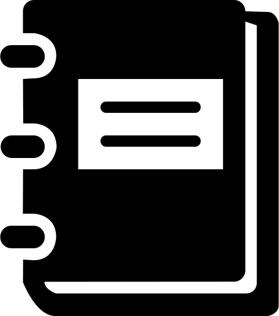
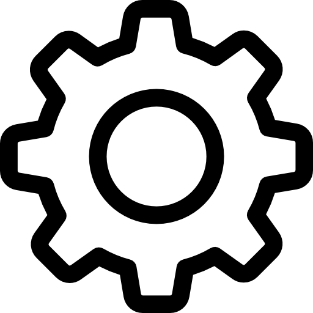
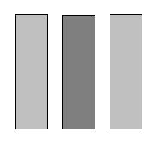
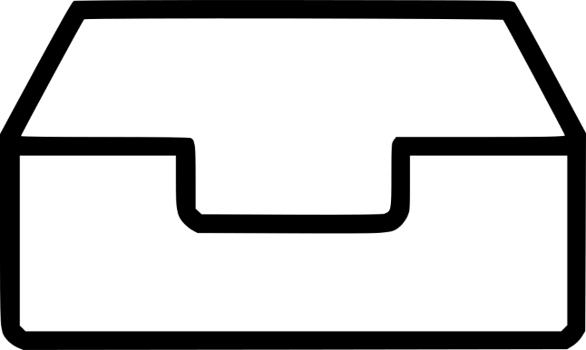
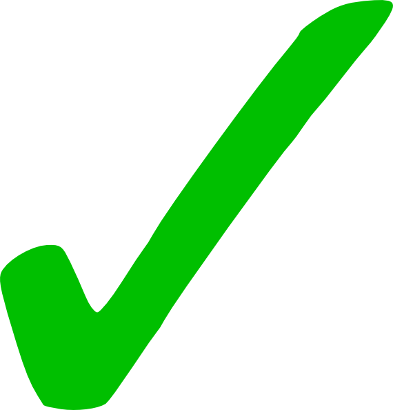
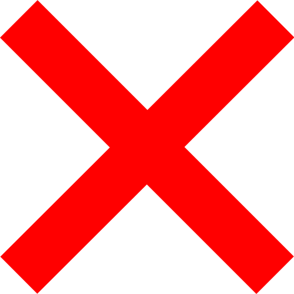
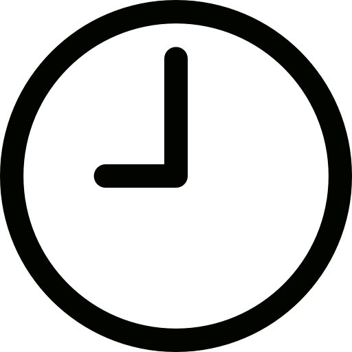
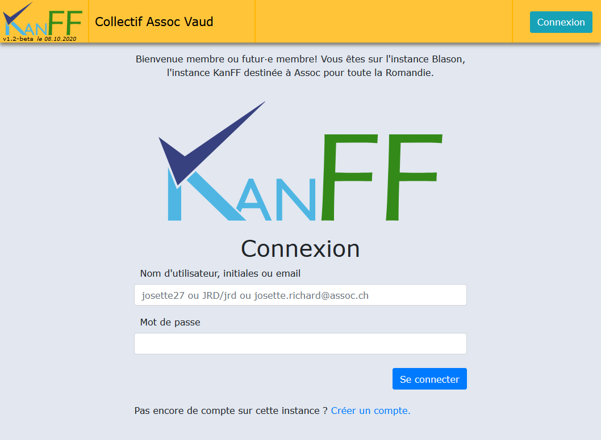

<!--/**
 *  Project: KanFF
 *  File: kanff-doc-user-fr.md user manual of KanFF
 *  Author: Samuel Roland
 *  Relecture:
 *  Creation date: 22.10.2020
 *  Version: 0.2.2
 *  Versiondate: 2021-01-02 23:10:00
 *  INFO: here is the manual to learn how to use KanFF. This file is hosted in the GitHub repository.
 *  To get regular updates of this manual, each instance take content directly from GitHub on branch develop and not from a local file.
 *  If commits pushed to GitHub are WIP (Work In Progress), they must be pushed on another feature branch to not impact production.
 *  At each merge or commit on develop, version and versiondate must be updated. Don't break the syntax because these 2
 *  values are important to notify the users (on the manual) that the manual is more recent than the last time they saw it.
 *  There is no title h1 ("#" so level 1) and no "table of content" mention at start because it's generated in the php script.
 *  When writing in this file, the result should be looked in the manual directly (activate dev mode to load the local file)
 *  and tested on the test instance.
*/ -->

[INSERT TOC HERE]

## Introduction
Ce mode d'emploi vous permet d'apprendre à utiliser KanFF. Si vous recherchez des informations sur le projet, le code source, la documentation technique, vous les trouverez ici [ADDLINK].
L'intention de ce manuel est d'être accessible au plus grand nombre, les personnes les plus à l'aise sauteront directement aux bons chapitres et les autres personnes iront pas à pas (avec l'aide des captures d'écrans).

## Contexte d'utilisation
Vous êtes membre d'un collectif, d'un groupe, d'un mouvement social, une association, ... (appelé ici "collectif" afin de simplifier) et votre collectif est inscrit sur une instance KanFF ? Vous aimeriez être guidé pour vos premiers pas ? Alors vous êtes au bon endroit.

## Mini-dictionnaire
Certains termes ne sont pas forcément intuitifs, leurs définitions est donc données ici.

Propres à KanFF:
- **Données internes**: toutes les informations stockées dans l'application incluant les membres, les groupes, les projets, les travaux, les tâches, concernant un collectif. Ces données ne sont pas publiques mais accessibles uniquement aux membres du collectif.
- **Projets**:
- **Travaux**: Ce sont des parties d'un projet. (Le projet étant trop gros pour gérer les tâches sans séparations). Ils regroupent un ensemble de tâche relatives à la même partie d'un projet. (Ex: projet YYYY)
- **Tâches**:
- **Les actions**: une action est quand vous créer, modifier ou supprimer un ou plusieurs éléments... L'affichage n'est pas une action.
- **Messages sur les actions**: ce sont des messages qui indiquent après une action si elle a réussi ou non et si non, la raison de l'échec.
  - 2 types:
    - **temporaires**: ils s'affichent en haut à droite avec 
    - **fixes**: ils sont oranges et s'affichent sous le menu ou au milieu des pages.  

Techniques:
- **Instance**: serveur sur lequel est installé KanFF. L'instance est accessible via une **URL** (`blason.com` par ex.) et a un **nom** donné par la personne la gérant (par exemple `Blason`)
- **Admin**: Membres ayant accès à des options avancées de gestion (dans le collectif, dans les groupes) qui ne sont pas utilisables par les autres membres.
- **URL**: Lien internet vers une ressource stockée sur internet (site web, fichier, ...).

## Trouver ses repères
Il peut être compliqué de trouver ses repères dans une grosse application. Voici quelques informations générales qui vous permettront de ne plus être perdu·e.

### Significations des icônes
-  **Lien vers une section du mode d'emploi**. En haut à côté des initiales, c'est un lien pour la section de la page. Les autres endroits où cette icône apparaît c'est pour des informations plus spécifiques. Un nouvel onglet est ouvert.
-  **Info-bulle d'aide** permettant d'avoir quelques courtes précisions sans quitter la page.
-  **Déconnexion**.
-  **Réglages** possibles.
-  **Le kanban**. Utilisé sur la page `Projets`.
-  **Détails** d'un élément.
-  **Bouton pour copier un lien**.
-  **Bouton pour ouvrir un lien** dans un nouvel onglet.
-  **Invisible**. Quelquechose est invisible pour les personnes à l'extérieur (d'un projet, d'un groupe, ...).
-  **Boîte de réception**. Ce travail est la boîte de réception du projet.
-  **Information sur un statut**.
-  **L'action a réussi**. Affiché dans les messages sur les actions temporaires.
-  **L'action a échoué**. Affiché dans les messages sur les actions temporaires.
-  **Mesure de l'importance**, pour les projets.
-  **Mesure de l'urgence**, pour les projets, travaux et tâches.
-  **Répétitif**. Utilisé pour les travaux.

### Sur les formulaires
- **Les compteurs de caractères**: Tous *les champs de texte ont une longueur maximum* qui sont généralement bien assez grande pour la majorité des cas.  
  Afin de savoir quand vous atteignez les limites, des compteurs de caractères sont affichés à côté de chaque champ de texte. Certains sont constamment affichés, d'autres s'affichent uniquement après que le 4/5 du maximum autorisé soit atteint.  
  

## A quoi ça sert ?
KanFF vous permet de gérer des projets et des tâches, réalisés par des groupes incluant des membres, au sein d'un collectif et de manière collaborative.

    Oui mais gérer comment ?

Gérer signifie: créer, afficher, modifier et supprimer. Vous pouvez faire ces 4 actions sur quasiment toutes les données internes.

## Un peu d'imagination
Dans ce mode d'emploi, nous allons prendre un exemple concret:  
**Josette Richard** a créé un collectif appelé `Collectif Assoc Vaud` il y a 2 mois avec 2 autres personnes: **Vincent Rigot** et **Mégane Blan**. Le collectif a pour but d'organiser des événements et actions tentant de faire converger diverses luttes. Le collectif démarre à très peu de personnes mais de nombreuses se montrent intéressées à rejoindre. Ensemble il a été décidé d'utiliser KanFF pour gérer les projets collaborativement et faire grandir le collectif.

Josette a trouvé une instance qui a accepté d'y inscrire le collectif. C'est l'instance `Blason` à l'URL `kanff.blason.com`.
Mégane et Vincent doivent maintenant rejoindre cette instance en y créant un compte. Mégane d'abord, accède à `kanff.blason.com` avec son navigateur web.

## Compte utilisateur·ice:
Pour accéder aux données (membres, groupes, projets, tâches, ...) d'un collectif vous devez avoir un compte et vous faire approuver par votre collectif. Votre compte est propre à une instance et ne peut pas être utilisé sur une autre instance.

### Créer un compte
- Aller sur la page `Créer un compte` avec le lien en bas de la page de connexion:

- Remplir le formulaire:
    - Les informations principales et d'identification sont obligatoires, elles permettent de vous identifier lors de la connexion.
    - Le reste est facultif et uniquement à titre d'information pour les autres membres du collectif, qui peuvent d'ailleurs voir toutes les informations que vous rentrer (excepté le mot de passe évidemment). A vous donc de choisir ce que vous inscrivez comme information ou pas. Ne mettez pas d'information sensibles, notamment dans la biographie...

Quelques informations supplémentaires quant aux champs du formulaire:
- Certains champs sont limités en taille.
- Le mot de passe vous est demandé 2 fois pour empêcher les fautes de frappes.
- Les signes "?" vous donnent une information supplémentaire qui peut vous aider.
- Les initiales sont uniques et générées automatiquement selon un format simple (première lettre du prénom + première lettre du nom + dernière lettre du nom)

### Connexion
- Aller sur la page `Connexion` qui est la première page visible en arrivant sur l'instance.

#### 3 manières différentes pour se connecter
- Avec ses initiales (les initiales peuvent aussi être en minuscules, il n'y a pas de différence)
  
- Avec son nom d'utilisateur·ice
  
- Ou avec son email  

... et bien sûr son mot de passe obligatoire!

### Mon compte
Cette page permet de gérer son compte (pouvoir modifier ses informations personnelles) et changer son mot de passe. Vous pouvez y accéder depuis le cercle avec vos initiales en haut à droite.

#### Changement du mot de passe
Il est possible de changer de mot de passe. Pour ceci vous devez connaître l'actuel et entrez 2 fois le nouveau. Sur la page `Mon compte`, accédez en bas au formulaire `Changement du mot de passe`.
1. Rentrez le mot de passe actuel
1. Rentrez le nouveau mot de passe
1. Rentrez le nouveau mot de passe une 2ème fois

#### Archivage son compte

#### Suppression du compte

### Accès limité
La page `Accès limité` s'affiche lorsque votre compte n'a pas encore été approuvé, ou qu'il est archivé ou banni. Cette limitation permet de ne pas rendre publique les données du collectif à n'importe qui qui créerait un compte.

### A propos
La page `A propos` en cliquant sur le nom du collectif en haut à gauche, vous permet d'en savoir plus sur le collectif, l'instance et sur KanFF.

### Déconnexion
Pour vous déconnecter de votre session, il suffit de cliquer sur le cerle initiales, puis `Déconnexion`.
Si vous utilisez un ordinateur qui ne vous appartient pas ou que vous partagez, il est important de se déconnecter afin de ne pas laisser l'accès à votre compte à une autre personne.

## Menu
Dans le menu en haut, vous avez les options suivantes:
- Dashboard: c'est le tableau de bord personnel. Il contient xxxx
- Projets: la liste des projets du collectif triés par catégories et par groupes d'état.
- Groupes: la liste des groupes visibles (pour vous) du collectif.
- Membres: la liste des membres du collectif séparés selon leur état.

## Dashboard

## Projets
### Projets
Cette page est une liste des projets du collectif visibles pour vous. Elle contient 3 options permettant de filtrer les projets.

### Détails d'un projet
Cette page est une liste des projets du collectif visibles pour vous. Elle contient 3 options permettant de filtrer les projets.

#### Groupes participants
C'est la liste des groupes qui participe au projet. En effet, les projets peuvent être gérés par plusieurs groupes, notamment lorsque que le projet demande des compétences spécifiques à certains groupes, mais la plupart du temps un seul groupe gérera le projet.

#### Gestion des groupes participants
A venir.

#### Travaux
A venir.

#### Gestion des travaux
A venir.

#### Journal de bord
Le journal de bord permet de consigner tous les événements et décisions qualifiés d'importants.

#### Gestion du journal de bord
A venir.

### Créer un projet
Un bouton `Nouveau projet` dans la page `Projets` vous emmène sur la page de création d'un projet.

- Remplissez un nom, une description et un objectif.
- Les projets étant réalisés par un ou plusieurs groupes (et non pas par des membres directement), vous devez choisir le groupe qui va créer et gérer le projet et dont vous faites partie.

### Kanban d'un projet
C'est la page principale qui permet de gérer les tâches des projets.

#### Créer une tâche
A venir.

#### Détails d'une tâche
A venir.

####  une tâche
A venir.

## Groupes
A venir.

## Membres
### Membres
La liste des membres du collectif.
Options de filtres:
- 